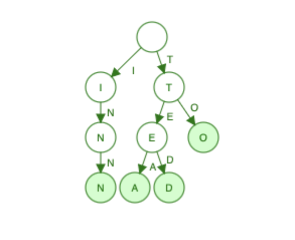
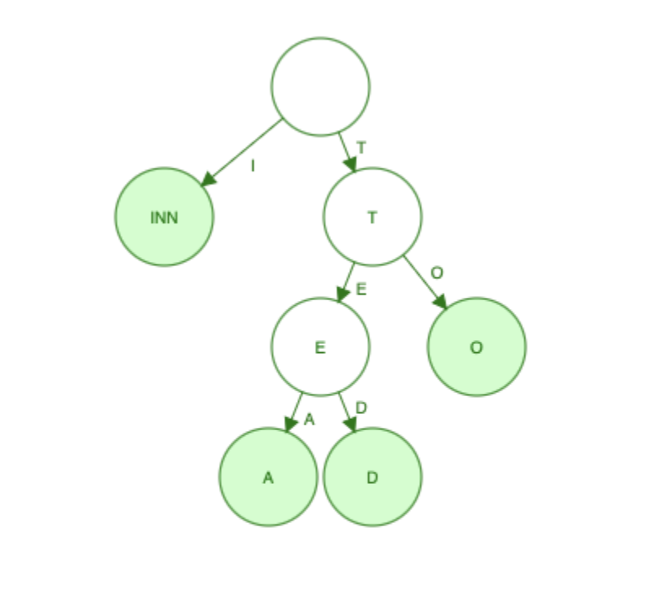

## 前言
路由系统是 Gin 框架的核心组成之一，本文以前缀树为切入点，前缀树作为一种高效的数据结构，为我们提供了理解路由匹配的基础。随后引入更为先进和灵活的 Radix Tree。最后聚焦于 Gin 框架中路由树的实现细节，探讨 Gin 是如何在其内部构建和维护这一路由树结构的。

**下文中所有截取的源代码均来自 Gin 框架的 v1.9.1 版本，可能与最新版本的源代码存在差异。**

## 前缀树
前缀树，又称为字典树，英文名 Trie，它就是一个像字典一样的树。前缀树具有如下特点：
1. 除了根节点，每个节点都对应一个字符。
2. 从根节点到任意一个节点，路径上经过的字符连接起来，就是该节点对应的字符串。
3. 如果将每个节点的单个字符看作是一个只包含唯一字符的字符串，那么每个节点的所有子节点的首字母都不相同，这保证了从一个节点到其子节点的路径都是唯一的。下文中介绍的 Radix Tree 也具有这一特点。

图 1 是一个插入了 "TO", "TEA", "TED", "INN" 后的前缀树，其中绿色节点表示字符串的结束。


## Radix Tree
Radix Tree，基数树，又称为压缩前缀树，在普通前缀树的基础上节省了空间。压缩的含义在于：在普通前缀树中，如果一个节点只有一个子节点，那么这个节点就可以和它的子节点合并，这样就可以节省一个节点的空间。
图 2 是一个插入了 "TO", "TEA", "TED", "INN" 后的 Radix Tree。


## Gin的路由树实现
Gin 框架为每个 HTTP 方法都维护了一棵独立的 Radix Tree，这些 Radix Tree 以切片的形式存储在 `Engine` 结构体中（`gin.go` 文件的 Line 166）。
后面均以 `GET` 方法为例，也即所有举例的路径都是插入的同一棵 Radix Tree。
一棵 Radix Tree 的结构体如下：
```go
// tree.go
// Line 52
type methodTree struct {
	method string
	root   *node
}
```
Radix Tree 中每个节点都是 `node` 结构体类型，`node` 结构体定义如下：
```go
// tree.go
// Line 116
type node struct {
	path      string
	indices   string
	wildChild bool
	nType     nodeType
	priority  uint32
	children  []*node // child nodes, at most 1 :param style node at the end of the array
	handlers  HandlersChain
	fullPath  string
}

// tree.go
// Line 107
type nodeType uint8

const (
	static nodeType = iota
	root
	param
	catchAll
)
```
`node` 结构体中各个变量的含义如下：
1. `path`：该节点所表示的路径段。比如依次插入了路径 `/use` 和 `/usa` ，那么会产生一个父节点，它的 `path` 为 `/us`
2. `indices`：是一个字符串，包含该节点的所有子节点的首字母。上述例子中，父节点的 `indices` 为 `ea`
3. `wildChild`：用于判断该节点的子节点中是否存在通配符节点，比如 `:id` 或 `*name`
4. `nType`：是一个枚举类型 `nodeType`，表示该节点的类型，取值有：
	- `static`：普通节点，表示普通的路径段，如 `/us`
	- `root`：根节点
	- `param`：通配符节点，表示以 `:` 开头的参数，如 `:id`
	- `catchAll`：通配符节点，表示以 `*` 开头的参数，如 `*name`
5. `priority`：该节点的优先级，用于在插入节点时确定节点的插入位置。优先级较高的节点将会被放在前面
6. `children`：`*node` 类型的切片，表示该节点的所有子节点。子节点中至多有一个 `param` 类型的节点
7. `handlers`：表示与该节点关联的处理函数链
8. `fullPath`：表示从根节点到该节点的完整路径

## Gin的路由注册
平时我们会使用类似下面的代码来注册路由：
```go
r := gin.Default()
r.GET("/user/:name", func(c *gin.Context) {})
```
深入 `GET` 方法的源代码，我们可以发现其实它调用了一个 `handle` 方法：
```go
// routergroup.go
// Line 116
func (group *RouterGroup) GET(relativePath string, handlers ...HandlerFunc) IRoutes {
	return group.handle(http.MethodGet, relativePath, handlers)
}

// Line 86
func (group *RouterGroup) handle(httpMethod, relativePath string, handlers HandlersChain) IRoutes {
	absolutePath := group.calculateAbsolutePath(relativePath)
	handlers = group.combineHandlers(handlers)
	group.engine.addRoute(httpMethod, absolutePath, handlers)
	return group.returnObj()
}
```
这个 `handle` 函数做了三件事：
1. 将传入的相对路径转换为绝对路径
2. 将传入的处理函数链与 `RouterGroup` 中的处理函数链合并
3. 将生成的绝对路径和处理函数链插入到 `httpMethod` 对应的 Radix Tree 中
我们重点关注第三步，`Engine.addRoute` 方法的源代码如下：
```go
// gin.go
// Line 322
func (engine *Engine) addRoute(method, path string, handlers HandlersChain) {
	// other code

	root := engine.trees.get(method)
	if root == nil {
		root = new(node)
		root.fullPath = "/"
		engine.trees = append(engine.trees, methodTree{method: method, root: root})
	}
	root.addRoute(path, handlers)

	// other code
}
```
上述源代码的含义是：首先获取给定 `method` 对应的 Radix Tree，如果不存在，则创建一个新的 Radix Tree，并将其插入到 `Engine.trees` 中。然后调用 `root.addRoute` 方法，将路径和处理函数链插入到 Radix Tree 中。
在根节点上调用的 `addRoute` 函数的源代码如下：
```go
// tree.go
// Line 152
func (n *node) addRoute(path string, handlers HandlersChain) {
	fullPath := path
	n.priority++

	// Empty tree
	if len(n.path) == 0 && len(n.children) == 0 {
		n.insertChild(path, fullPath, handlers)
		n.nType = root
		return
	}

	parentFullPathIndex := 0

walk:
	for {
		// Find the longest common prefix.
		// This also implies that the common prefix contains no ':' or '*'
		// since the existing key can't contain those chars.
		i := longestCommonPrefix(path, n.path)

		// Split edge
		if i < len(n.path) {
			// other code
		}

		// Make new node a child of this node
		if i < len(path) {
			// other code
		}

		// Otherwise add handle to current node
		if n.handlers != nil {
			panic("handlers are already registered for path '" + fullPath + "'")
		}
		n.handlers = handlers
		n.fullPath = fullPath
		return
	}
}
```
这个 `addRoute` 函数首先 Radix Tree 是否为空，需要同时满足 `len(n.path) == 0` 和 `len(n.children) == 0`，因为：
1. 假设依次插入了若干个路径，这些路径没有公共前缀，比如 `/abc` 和 `xyz`，此时根节点的 `path` 为空，但根节点有子节点，Radix Tree 不为空，所以仅仅判断 `len(n.path) == 0` 是不够的。
2. 假设之前只插入了一个路径，比如 `/abc`，根据上文叙述的 Radix Tree 的特点：当某个节点具有唯一子节点时，该节点会和子节点合并，此时根节点的 `path` 为 `/abc` 并且没有子节点，所以仅仅判断 `len(n.children) == 0` 是不够的。

如果两个条件都满足，则直接将路径和处理函数链插入到根节点中，并且将节点的类型标记为 `root`。

否则，进入 `walk` 代码块，该代码块的作用是将路径插入到 Radix Tree 中。

在 `for` 循环中，首先求出 `path` 和 `n.path` 的最长公共前缀的长度 `i`，然后判断：
- 如果 `i < len(n.path)`，说明 `n.path` 中存在一个不匹配的后缀，需要对节点 `n` 进行分裂，此时需要为这个后缀构建一个新的节点 `child`，并且将节点 `n` 的原有的子节点挂在节点 `child` 下，然后将节点 `child` 作为节点 `n` 的新的子节点。
- 如果 `i < len(path)`，说明 `path` 中存在一个不匹配的后缀，此时需要为这个后缀构建一个新的节点 `child`，并且将节点 `child` 加入到 `n` 的子节点中。

下面贴出两个 `if` 条件的源代码，添加了更详细的注释和例子：

首先是 `i < len(n.path)` 的情况：
```go
// tree.go
// Line 172

// Split edge
// 例如, n.path = "/user"，path = "/used",
// 可以得到 i = 4, n.path 中有一个不匹配的后缀 "r"
if i < len(n.path) {
	// 为这个后缀构建新节点, 变量名为 child
	child := node{
		// child 节点的 path 为后缀 "r"
		// 因为 n 节点原有的子节点需要挂在 child 节点下
		// 所以 indices, children, handlers 这些信息都继承自 n 节点
		path:      n.path[i:],
		wildChild: n.wildChild,
		nType:     static,
		indices:   n.indices,
		children:  n.children,
		handlers:  n.handlers,
		priority:  n.priority - 1,
		fullPath:  n.fullPath,
	}

	// 将 child 作为 n 的新的子节点
	n.children = []*node{&child}
	// []byte for proper unicode char conversion, see #65
	// 更新 n 的 indices 字符串为后缀的首字母
	n.indices = bytesconv.BytesToString([]byte{n.path[i]})
	// 更新 n 的 path 为最长公共前缀
	n.path = path[:i]
	n.handlers = nil
	n.wildChild = false
	n.fullPath = fullPath[:parentFullPathIndex+i]
}
```

然后是 `i < len(path)` 的情况：
```go
// tree.go
// Line 194

// Make new node a child of this node
// 若满足此 if 条件，说明需要为剩下的不匹配的后缀创建一个新的节点
if i < len(path) {
	// 将 path 更新为剩下的后缀
	path = path[i:]
	// 获取后缀的首字母
	c := path[0]

	// '/' after param
	// 这个 len(n.children) == 1 没太看懂
	// 据 ChatGPT 的说法是：为了处理一种特殊情况, 即参数节点后面跟着一个斜杠, 如 :param/。
	if n.nType == param && c == '/' && len(n.children) == 1 {
		parentFullPathIndex += len(n.path)
		n = n.children[0]
		n.priority++
		continue walk
	}

	// Check if a child with the next path byte exists
	// 判断节点 n 的子节点是否和 path 存在公共前缀
	// n.indices 保存的是所有子节点的首字母
	for i, max := 0, len(n.indices); i < max; i++ {
		if c == n.indices[i] {
			// 如果存在符合条件的子节点, 那么这个子节点需要进行分裂操作
			// 将 n 更新为这个子节点, 然后继续执行 walk 代码块
			// 例如：依次插入了 "/cont", "/contact", 那么此时的树形状是：/cont --> act, n.path = "/cont"
			// 之后又插入了 path = "/contac", i = 5, 并且 "ac" 和 "act" 存在公共前缀
			// 此时需要将 n 更新为 "act" 这个子节点，然后继续执行 walk 代码块
			parentFullPathIndex += len(n.path)
			i = n.incrementChildPrio(i)
			n = n.children[i]
			continue walk
		}
	}

	// Otherwise insert it
	// 此时, path 和 n 的子节点不存在公共前缀, 应该创建一个新节点插入到 n 的子节点中
	if c != ':' && c != '*' && n.nType != catchAll {
		// 如果 path 的首字母不是通配符, 那么 path 是 static 类型的节点
		// 并且 n 的类型不是 catchAll（因为 catchAll 节点不能有子节点）
		// 那么需要将 path 的首字母加入到 n 的 indices 中
		// 然后创建一个新节点 child, 将 child 加入到 n 的子节点列表中
		// []byte for proper unicode char conversion, see #65
		n.indices += bytesconv.BytesToString([]byte{c})
		child := &node{
			fullPath: fullPath,
		}
		n.addChild(child)
		n.incrementChildPrio(len(n.indices) - 1)
		n = child
	} else if n.wildChild {
		// inserting a wildcard node, need to check if it conflicts with the existing wildcard
		// path 是 ":" 或 "*" 开头的通配符节点, 并且 n 的子节点中已经存在通配符节点
		// 因此需要检查是否存在冲突

		// 将 n 赋值为 n 的子节点中的通配符节点
		n = n.children[len(n.children)-1]
		n.priority++

		// Check if the wildcard matches
		// 如果, n.path 是 path 的前缀
		// 并且, path 在 len(n.path) 之后的第一个字符是 '/'
		if len(path) >= len(n.path) && n.path == path[:len(n.path)] &&
			// Adding a child to a catchAll is not possible
			n.nType != catchAll &&
			// Check for longer wildcard, e.g. :name and :names
			(len(n.path) >= len(path) || path[len(n.path)] == '/') {
			continue walk
		}

		// Wildcard conflict
		// 存在冲突, 则引发 panic
		pathSeg := path
		if n.nType != catchAll {
			pathSeg = strings.SplitN(pathSeg, "/", 2)[0]
		}
		prefix := fullPath[:strings.Index(fullPath, pathSeg)] + n.path
		panic("'" + pathSeg +
			"' in new path '" + fullPath +
			"' conflicts with existing wildcard '" + n.path +
			"' in existing prefix '" + prefix +
			"'")
	}

	// n 是 catchAll 类型的节点
	// 或者，path 是通配符节点，并且 n 的子节点没有通配符节点
	// 尝试插入新节点
	n.insertChild(path, fullPath, handlers)
	return
}
```

## 小结
这篇文章从 Trie 和 Radix Tree 出发，简要讲解了 Gin 中路由树的构建过程：总的来说，是一个从 `root` 出发，不断比较最长公共前缀，分裂节点或插入节点的过程，是一个从上至下，逐层深入的过程。

作为 Go 的初学者，这是我第一次阅读开源项目的源代码，也是第一次写这种类型的文章，其中肯定有错误和疏漏，比如 `insertChild` 函数和 `addChild` 函数的实现和区别在本文中并没有提及，我认为理解这两个函数有助于更细致地理解路由树的构建过程，先挖个坑在这里。

出于篇幅的考虑，关于路由树的匹配过程就放在下一篇文章里了。希望这篇文章能够帮助到大家。