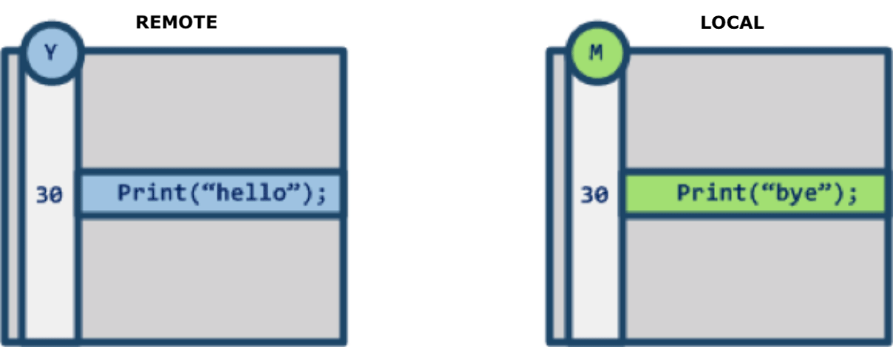
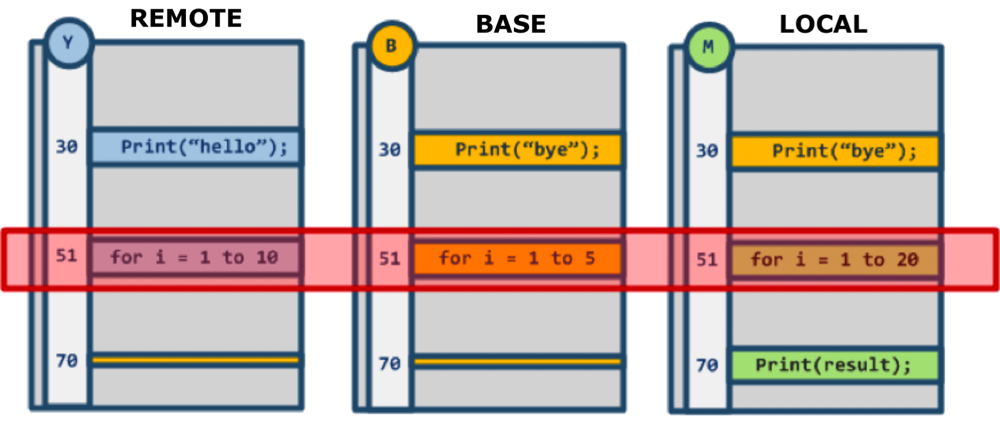
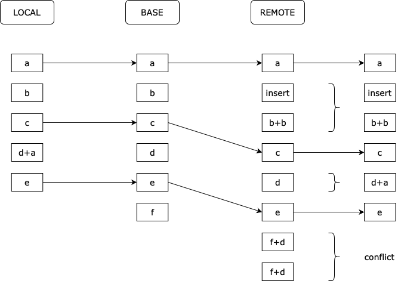
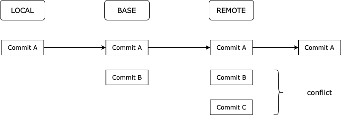

## 前言
`cherry-pick` 是一个十分好用的命令，它在我们的日常开发中发挥着关键作用，同时，关于 `cherry-pick` 的定义、在实际开发中适用的场景和它的实现原理，都值得我们深入了解。

本文将讲解 `cherry-pick` 的实现，特别是命令内部使用的 Three Way Merge 算法，该算法能够自动解决一些冲突问题，提高开发效率。

## 如何使用 `cherry-pick`
我们一般将 `cherry-pick` 命令的作用描述为：将某一个分支上的若干个提交应用到另外一个分支上。

假设有以下的若干次提交：
```
A -- B -- C -- D         master
		   \
		    E -- F -- G  feature
```
如果我们想要将 F 和 G 这两次提交应用到 master 分支上，我们可以切换到 master 分支，然后使用 `cherry-pick` 命令：
```bash
git checkout master
git cherry-pick F G
```
事实上，`git cherry-pick` 命令的参数是 commit ID, 这里为了简单，直接使用了提交的名字。

执行完上述的命令之后，我们会得到如下的提交历史：
```
A -- B -- C -- D -- F' -- G'  master
		   \
		    E -- F -- G       feature
```
这里 F' 和 G' 都是新的提交，F 和 F'，G 和 G' ，它们的 commit ID 是不一样的。

总而言之，`cherry-pick` 提供了一种灵活的方式，使得你可以有选择地将某个分支上的某些提交应用到当前分支，而不必执行整个分支的合并。

有一些适用 `cherry-pick` 的场景，包括但不限于：
- 如果在一个分支上发现了 Bug，并且这个 Bug 在另外一个分支上已经被修复了，你可以直接使用 `cherry-pick` 将修复的提交应用到当前分支上。
- 将某个废弃的分支上的一部分提交提取出来。

## 深入理解 `cherry-pick`
假设我们有一个仓库，目前它通过 commit A 提交了一个文本文件 `text.txt`，文件内容只有一行：
```
Commit A
```
然后在 Commit A 上创建一个新的分支 `feature` ，在 `feature` 分支上提交了 Commit B，它创建了一个新文件 `text2.txt`，并且修改了 `text.txt` 的内容：
```
Commit A
Commit B
```
紧接着又提交了 Commit C，它创建了一个新文件 `README.md`，并且修改了 `text.txt` 的内容为：
```
Commit A
Commit B
Commit C
```
最后，我们切换回 `main` 分支，执行 `cherry-pick` 将 `feature` 分支上的 Commit C 应用到 `main` 分支上：
```bash
git checkout main
git cherry-pick C
```
我们期望执行完命令之后的提交历史是这样的：
```
A -- C'     main
 \
  B -- C    feature
```
不过在真正执行命令之前，可以先思考一下在 `main` 分支中最终会有几个文件？在 `text.txt` 中最终会有哪几行内容？

正确答案是：`main` 分支上会多出一个 `README.md` 文件，其次，在 `text.txt` 文件上产生一个冲突。使用 `git diff` 命令可以查看冲突的内容：
```
  Commit A
++<<<<<<< HEAD
++=======
+ Commit B
+ Commit C
++>>>>>>> c316dc5 (Commit C)
```

如果我们在处理冲突时选择了接受传入的提交(Accept Incoming changes)，那么最终 `text.txt` 中会包含三行内容。

这个小实验也证明了对于 `cherry-pick` 命令，更准确的定义应该是：将某个提交引入的更改应用到当前分支，正如官方文档中描述的：Apply the changes introduced by some existing commits

要理解为什么最新的 `main` 分支中包含这些内容，需要先理解 `cherry-pick` 中使用的 Three Way Merge 算法。不过在此之前，先介绍一下相对简单的 Two Way Merge 算法。

## Two Way Merge
Two Way Merge 算法是最简单的一种合并算法，它只会比较两个分支的最新提交，然后将两个分支的最新提交进行合并。如果两个分支的最新提交都修改了同一个文件的同一行，那么就会产生冲突。

先定义两个概念，假设我们执行了下面的代码：
```bash
git checkout main
git merge --no-ff feature
```
- **LOCAL**：执行合并时的当前分支的最新提交，在上面的例子中是 `main` 分支的最新提交。
- **REMOTE**：被合并的目标分支的最新提交，在上面的例子中是 `feature` 分支的最新提交。

再举个例子，假设从某个提交节点分出的两个分支准备合并时有下图中的情况：



要合并的两个文件中只有第 30 行不一样，这个 “不一样” 可能是下面四种情况导致的：

1. LOCAL 没有修改，REMOTE 修改了内容。
2. REMOTE 没有修改，LOCAL 修改了内容。
3. LOCAL 和 REMOTE 都修改了内容。
4. LOCAL 和 REMOTE 都新增了一行。

对应的四种处理方式应该是：
1. 使用 REMOTE 的内容。
2. 使用 LOCAL 的内容。
3. 产生冲突，需要手动解决。
4. 产生冲突，需要手动解决。

对于第一种和第二种情况，我们期望合并算法能够自动帮我们处理好，但是对于 Two Way Merge 算法来说，它没有足够的信息来自动完成这些操作，所以它只能发现并报告产生了冲突，然后由人工来手动解决。

## Three Way Merge
Three Way Merge 算法在 LOCAL 和 REMOTE 的基础上，又提出了 BASE 的概念：即需要合并的文件在修改前的版本。

**一般来说**，BASE 是 LOCAL 和 REMOTE 的最近共同祖先，一种特殊情况是下文中将会进一步解释的 `cherry-pick` 命令。

画个图理解就大概是下面的样子：
```
A -- BASE -- D -- LOCAL     main
	   \
	    B -- C -- REMOTE    feature
```

有时候 LOCAL 和 REMOTE 的最近公共祖先是不唯一的，此时就要用到 Recursive Three Way Merge 算法，具体步骤为：
1. 把多个最近公共祖先递归调用 merge，生成一个虚拟节点
2. 让虚拟节点作为 BASE

在 Three Way Merge 中，最终合并的结果是根据 BASE、LOCAL 和 REMOTE 的内容经过比较分析得出的。比较的逻辑是：**只要 BASE、LOCAL 和 REMOTE 中任意两个的内容一致，就放弃 BASE 中的内容；如果都不一样，就需要手动解决冲突。**

比如：
1. BASE == LOCAL  &&  BASE != REMOTE：保留 REMOTE 中的内容
2. BASE == REMOTE  &&  BASE != LOCAL：保留 LOCAL 中的内容
3. LOCAL == REMOTE  &&  LOCAL != BASE：保留 LOCAL(REMOTE) 中的内容
4. BASE != LOCAL  &&  BASE != REMOTE  &&  LOCAL != REMOTE：需要手动处理冲突

上面是假设三个分支文件都存在的情况，当某个分支新建了或是删除了文件，那么可以把缺少的文件当作是空文件来考虑，有以下的情况：
1. BASE 有  &&  LOCAL 有  &&  REMOTE 无：
	- BASE == LOCAL：删除文件
	- BASE != LOCAL：保留 LOCAL 中的内容(此时 BASE、LOCAL 和 REMOTE 互不相同，产生冲突，但是 REMOTE 中没有文件，所以直接取 LOCAL 中的内容)
2. BASE 有  &&  LOCAL 无  &&  REMOTE 有：与 1 同理
3. BASE 有  &&  LOCAL 无  &&  REMOTE 无：删除文件
4. BASE 无  &&  LOCAL 有  &&  REMOTE 无：取 LOCAL 中的内容
5. BASE 无  &&  LOCAL 无  &&  REMOTE 有：取 REMOTE 中的内容，与 4 同理
6. BASE 无  &&  LOCAL 有  &&  REMOTE 有：
	- LOCAL == REMOTE：取 LOCAL(REMOTE) 中的内容
	- LOCAL != REMOTE：产生冲突，需要手动解决

了解了比较合并的逻辑之后，我们来看一个复杂的例子：


在上图中，有三个不一致的地方：
1. 第 30 行：BASE 和 LOCAL 一致，所以算法会自动帮我们选择保留 REMOTE 的内容
2. 第 51 行：BASE、LOCAL 和 REMOTE 的内容都不一致，需要手动处理冲突
3. 第 70 行：BASE 和 REMOTE 一致，所以算法会自动帮我们选择保留 LOCAL 的内容

## Git 如何实现 `diff`
上文讲解了 Three Way Merge 是如何处理文件中的差异的，那么 Git 是如何得到文件的差异的呢？

我们知道 Git 在比较文件时是以行为单位进行比较的，在实现 diff 时，Git 是采用了最长公共子序列 LCS 算法的一种变体，感兴趣的同学可以自行搜索 Myers 差分算法。在这篇文章中，我们直接用 LCS 算法进行简单的讲解。



先求出三个文件内容的 LCS(上图中的 a、c、e 三行)，这个 LCS 将三个文件的内容分割成若干个块，这些块就是不相同的部分，然后对这些块执行 Three Way Merge 算法，就可以得到最终的合并结果。

## 回到 `cherry-pick`
在对 Three Way Merge 有了一定的了解之后，我们就可以解释 “深入理解 `cherry-pick`” 这一段中的那个例子了。

同时，我在介绍 BASE 这个概念的时候也提到了，在 `cherry-pick` 中，BASE 的取值不再是 LOCAL 和 REMOTE 的最近公共祖先，而是 REMOTE 的父节点。

因此，对于例子中的提交历史：
```
A     		main
 \
  B -- C    feature
```

执行：
```bash
git checkout main
git cherry-pick C
```
时，有：
- BASE = B
- LOCAL = A
- REMOTE = C

对于在 commit B 中新增的 `text2.txt` 文件：BASE 有，REMOTE 有，LOCAL 无，并且 BASE 和 REMOTE 的文件内容一致。因此 `cherry-pick` 的结果是：删除 `text2.txt` 文件。

对于在 commit C 中新增的 `README.md` 文件：BASE 无，REMOTE 有，LOCAL 无。因此 `cherry-pick` 的结果是：新增 `README.md` 文件。

对于 `text.txt` 中修改的内容，用图表示是这样的：


此时，我们可以选择是保留 LOCAL 中的内容，还是保留 REMOTE 中的内容。

## 总结
`cherry-pick` 命令用于将某些提交引入的变更应用到当前分支上，它的用法简单，但实现原理相对复杂，因为内部使用了 Three Way Merge 算法。该算法依据 BASE、LOCAL 和 REMOTE 的内容进行比较分析，得出最终的合并结果或将冲突告知给开发人员。

`cherry-pick` 在某些场景下是很有用的，但我们仍需细心，以防出现期望之外的文件变化。

## 参考资料
1. [A deeper understanding of the git cherry-pick operation](https://www.sobyte.net/post/2022-03/git-cherry-pick-intro/)
2. [怎么理解Git里的 "three-way merge" ？ - 蛋先生DX的回答 - 知乎](https://www.zhihu.com/question/30200228/answer/2590879392)
3. [Git三路合并算法(Three Way Merge)](https://marsishandsome.github.io/2019/07/Three_Way_Merge)

