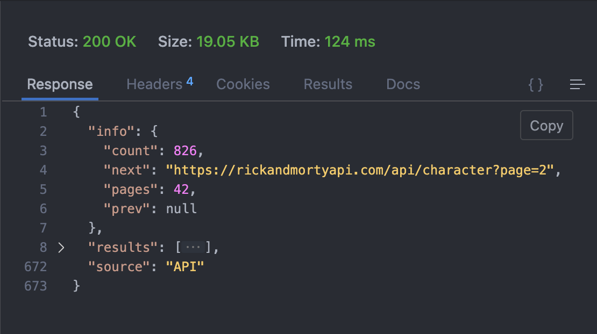
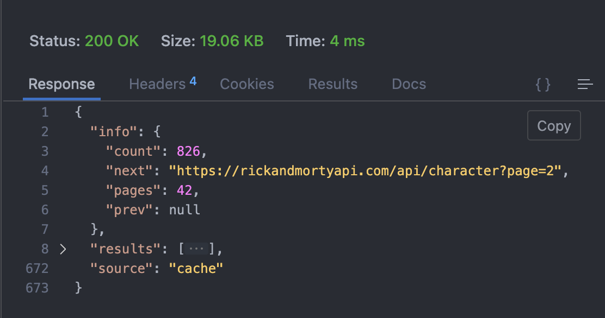

Redis(Remote Dictionary Server)是一个开源的 NoSQL 数据库，它性能强劲，并且提供了多种复杂和灵活的数据结构，能够适用于各种各样的业务需求。除此之外，通过复制、持久化(persistence)和客户端分片(client-sidesharding)等特性，用户可以很方便地将 Redis 扩展成一个能够包含数百 GB 数据、每秒处理上百万次请求的系统。

Redis 被广泛地使用在各类应用程序的服务器端缓存方案中，从而加速数据访问操作。

## 编写一个简单服务器

首先配置环境：

1. 安装 Redis 参考官方文档：[Get started with Redis](https://redis.io/docs/getting-started/)
2. 安装支持 Redis 的 Golang 客户端：[Getting started with Golang Redis](https://redis.uptrace.dev/guide/go-redis.html)

本文使用 [The Rick and Morty API](https://rickandmortyapi.com) 的 REST 版本作为数据源，它包含下列的端点，请求方法都是 `GET` ，返回的数据都是 json 格式。

```json
{
  "characters": "https://rickandmortyapi.com/api/character",
  "locations": "https://rickandmortyapi.com/api/location",
  "episodes": "https://rickandmortyapi.com/api/episode"
}
```

下面编写 `/characters` 的路由处理函数：

```go
package main

import (
	"encoding/json"
	"fmt"
	"io"
	"net/http"
)

func GetCharacters(w http.ResponseWriter, r *http.Request) {
	res, err := http.Get("https://rickandmortyapi.com/api/character")
	if err != nil {
		fmt.Fprintln(w, err)
		return
	}
	defer res.Body.Close()

	bytes, _ := io.ReadAll(res.Body)

	var obj map[string]interface{}
	json.Unmarshal(bytes, &obj)
	obj["source"] = "API"
	bytes, _ = json.Marshal(&obj)

	fmt.Fprintln(w, string(bytes))
}

func main() {
	http.HandleFunc("/characters", GetCharacters)
	http.ListenAndServe(":8080", nil)
}
```

代码第 22 行向 json 中增加了一个字段 `source` 表示该数据是从外部 API 获取的。

使用一个 HTTP 客户端向 `/characters` 端点发送请求，可以得到这次请求的响应时间，经过多次测试，响应时间都在 100+ ms。这个时间包括了向外部 API 请求数据的时间，我们可以把它当作是一次耗时的数据处理操作，后面可以使用 Redis 来缓存数据。



## 使用Redis缓存

Redis 默认使用 `6379` 端口，并且在这个简单的程序中我没有设置密码：

```go
var rdb *redis.Client

rdb = redis.NewClient(&redis.Options{
  Addr:     "localhost:6379",
  Password: "",
  DB:       0,
})
```

接下来完善路由处理函数：首先从 Redis 中检查是否已经有缓存，若有则在 json 中增加 `source` 字段的值为 `cache` 表示是从 Redis 缓存中返回的数据；否则从外部 API 获取数据并保存在 Redis 中，设置过期时间为 10s。

```go
func AddSource(bytes []byte, source string) []byte {
	var obj map[string]interface{}
	json.Unmarshal(bytes, &obj)
	obj["source"] = source
	bytes, _ = json.Marshal(&obj)

	return bytes
}

func GetCharacters(w http.ResponseWriter, r *http.Request) {
	ctx := context.Background()

	// check if we have a cached value
	val, err := rdb.Get(ctx, "characters").Result()
	// if we have a cache hit, return the cached value
	if err == nil {
		bytes := AddSource([]byte(val), "cache")
		fmt.Fprintln(w, string(bytes))
		return
	}

	// otherwise we are calling api for response
	res, err := http.Get("https://rickandmortyapi.com/api/character")
	if err != nil {
		fmt.Fprintln(w, err)
		return
	}
	defer res.Body.Close()

	bytes, _ := io.ReadAll(res.Body)
	rdb.Set(ctx, "characters", string(bytes), 10*time.Second)

	bytes = AddSource(bytes, "api")
	fmt.Fprintln(w, string(bytes))
}
```

重新启动程序，用 HTTP 客户端测试一下。第一次请求应该是从外部 API 获取数据的，并且响应时间大概是 100+ ms，但是第二次请求就会从缓存中返回数据库了，响应时间只有 4ms：



## 总结

本文通过一个十分简单的程序介绍了 Redis 的基本使用，但这只是皮毛而已，推荐阅读[官方文档](https://redis.io/docs/)来获取更多 Redis 的知识。在将来你可以将 Redis 加入到自己的项目中，以显著提升应用的性能。

## 参考资料

1. [Reduce Response Times and Improve Performance with Redis Caching](https://betterprogramming.pub/how-to-cache-api-requests-with-redis-and-node-js-cba883385e7)
2. [Getting started with Golang Redis](https://redis.uptrace.dev/guide/go-redis.html)
