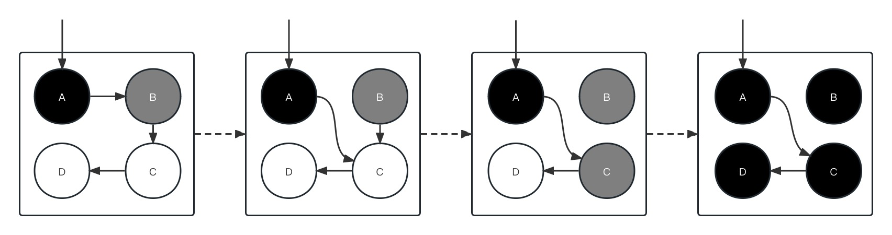

垃圾回收(Garbage Collection, GC)是一种自动内存管理技术，它删除在执行过程中不再被程序引用的对象，回收内存空间，防止内存泄漏。GC 算法可以分为跟踪垃圾回收算法(Tracing garbage collection)和引用计数算法(Reference counting)两种，跟踪垃圾回收算法又包括标记清除法和三色标记法等。如今谈到 GC，往往指的是跟踪垃圾回收算法，而不是引用计数算法。

在传统的编程语言，如 C/C++ 中，程序员需要使用 `free` 和 `delete` 关键字手动清理垃圾释放内存，但是当代码量十分庞大的时候，手动清理垃圾成为了一项艰巨的任务。大多数现代编程语言，如 Go，提供了垃圾回收机制，使程序员可以更专注于实现业务逻辑。当然，传统语言中的手动垃圾清理并不是没有优点，程序员可以将清理过程优化到极致，因此在性能表现上往往比自动垃圾回收的语言要好。

Go 在 V1.3 之前使用的是标记清除法，V1.5 引入使用写屏障技术的三色标记法，V1.8 引入使用混合写屏障技术的三色标记法。Go 的垃圾回收过程会放在一个独立的 goroutine 中，由 Go 调度器负责调度应用和垃圾回收器，实现应用和垃圾回收器的并发执行。下文对这几种方法做一个简要的介绍。

## 标记清除法(mark and sweep)

在标记清除法中，每个对象都保留一个二进制位表示标记。标记清除法的过程分为两个阶段：

1. 标记阶段：从一组根对象出发，根据引用关系遍历所有被引用到的对象，这些对象被认为是可达的，并且打上标记。
2. 清除阶段：遍历堆中的对象，清除所有未被打标记的对象，释放内存。并且把所有可达对象的标记位重置，用于下一轮回收。

> 根对象：指能被程序直接访问的对象，如常量、全局变量、goroutine执行栈上的变量和指向分配的堆内存的指针等。

> 图片来源：["mark-and-sweep"](https://en.wikipedia.org/wiki/Tracing_garbage_collection#/media/File:Animation_of_the_Naive_Mark_and_Sweep_Garbage_Collector_Algorithm.gif) by M17 / [CC0](https://creativecommons.org/publicdomain/zero/1.0/deed.en)

在上图中，箭头表示引用关系，由于 Object 5、7、8 没有被根对象集合中的任何对象直接或间接引用，因此它们被删除释放了。

标记清除法实现较为简单，并且每个对象只需要一个二进制位，占用空间小，但缺点在于：

1. 在算法执行过程中，程序必须暂停，这称为 STW(Stop The World)，不利于构建实时性应用。
2. 算法需要扫描两次内存，每个阶段各一次，时间效率低。
3. 清除后的内存空间是不连续的，会产生难以利用的外部碎片。

## 三色标记法(tri-color marking)

三色标记法将堆中的对象分为三类：

1. 白色对象：还未被垃圾回收器扫描的对象，初始状态下所有对象都是白色，扫描结束后仍为白色的对象会被删除并释放空间。
2. 灰色对象：正在被垃圾回收器扫描的对象，这些对象身上还有若干个引用的对象没有被扫描。
3. 黑色对象：已经扫描完成的对象，所有黑色对象都不会引用白色对象。注意，白色对象可能引用了黑色对象，但是这对垃圾回收器的操作没有影响。

三色标记法的执行过程如下（和 BFS 很相似）：

1. 初始状态下所有对象都是白色（除了根对象）。
2. 将根对象直接引用的对象标记为灰色，放入灰色对象队列（待处理队列）。
3. 从灰色对象队列中取出一个对象，标记为黑色，同时把它直接引用的白色对象标记为灰色并放入队列。
4. 重复步骤3，直到灰色对象队列为空。

> 图片来源："tri-color marking" by Squbidu / [CC BY-SA 4.0](https://creativecommons.org/licenses/by-sa/4.0/)

从上面的动图可以发现，三色标记法中的灰色对象是一种中间状态，白色对象无法直接变成黑色对象。扫描结束后堆中的对象要么是白色的，要么是黑色的，所有白色的对象都会被释放。

## 强/弱三色不变式

如果仅仅是按照上文的朴素的三色标记法操作，我们仍无法取消 STW。假设没有 STW，在标记的过程中对象仍可以执行读写操作，那么可能发生下面的情况：一个黑色对象引用了一个白色对象 W，同时一个灰色对象取消了对该白色对象 W 的引用关系，由于黑色对象已经扫描完毕了，此时的白色对象 W 就变成了不可达的对象，最后被垃圾回收器释放，导致了错误回收的问题。

为了解决不加 STW 导致错误回收的问题，大佬们提出了强/弱三色不变式，只要满足其一就可以保证不存在错误回收的问题。

- 强三色不变式：黑色对象不可以引用白色对象。
- 弱三色不变式：黑色对象可以引用白色对象，但是，该白色对象的被引用链上必须要有灰色对象，也即该白色对象必须受到灰色对象的保护，此时该白色对象最终一定会被标记为黑色。

想要满足三色不变式，需要用到下面介绍的屏障机制。

## 屏障机制

内存屏障(barrier)就是在用户读写数据、创建和修改对象指针之前需要执行的一段代码，类似于一个 hook 或者 Web 应用中的 middleware。屏障机制包括读屏障和写屏障，因为读屏障会在每次读操作之前执行，严重影响了程序性能，所以编程语言中的垃圾回收机制倾向于选择写屏障来保证一些约束条件。

三色标记法使用的写屏障机制，包括插入写屏障、删除写屏障、混合写屏障，目的是维护三色不变式。

### 插入写屏障

插入写屏障是 Dijkstra 在 1978 年提出的，它在创建引用关系时被触发。插入写屏障的主要思想是：若一个对象 A 引用了一个对象 B，那么将对象 B 的颜色修改为灰色并放入待处理队列中。不难看出插入写屏障满足了强三色不变式，因为被引用的白色对象会被强制修改为灰色。

图 3 展示了垃圾回收器和用户程序并发执行的一种情况：

1. 垃圾回收器把对象 A 引用的对象 B 标记为灰色并加入待处理队列，然后把对象 A 标记为黑色。
2. 对象 A 取消引用对象 B，转而引用对象 C，此时触发了插入写屏障，将对象 C 标记为灰色并加入待处理队列。
3. 垃圾回收器从待处理队列中取出对象 B 和对象 C，将它们标记为黑色。

插入写屏障实现相对简单，但是缺陷不容忽视。Go 中的对象可能分配在栈上，也可能分配在堆上，可能导致栈中对象和堆中对象的互相引用，因此栈中对象也是需要垃圾回收器扫描的。而插入写屏障比较耗费性能，栈有较高的性能要求，所以要么以降低栈操作的响应速度为代价，为栈中对象也增加插入写屏障；要么只在堆中对象使用插入写屏障，在一轮扫描完之后，对栈使用 STW 进行第二轮扫描。无论选择哪种方法都会对性能造成影响。

还有一个缺陷在于，它可能导致某些垃圾对象不会被及时回收。以图 3 为例，在第二步中对象 A 修改了引用关系，导致对象 B 不属于任何可达链，应该被清除，但由于此时对象 B 已经是灰色，最后也一定是黑色从而不会被回收，只有等到下一个垃圾回收周期对象 B 才会被回收。

### 删除写屏障

删除写屏障是 Yuasa 在 1990 年的论文《Real-time garbage collection on general-purpose machines》中提出的，它在删除引用关系时被触发。删除写屏障的主要思想是：若一个对象 A 取消引用对象 B，如果对象 B 是白色，那么标记为灰色放入待处理队列。删除写屏障满足弱三色不变式，因为它保证灰色对象到白色对象的路径不会断。

图 4 展示了垃圾回收器和用户程序并发执行的一种情况：

1. 垃圾回收器把对象 A 引用的对象 B 标记为灰色并加入待处理队列，然后把对象 A 标记为黑色。
2. 对象 A 取消引用对象 B，转而引用对象 C，触发了删除写屏障，但对象 B 已经是灰色的，因此没有进一步操作。
3. 对象 B 取消引用对象 C，触发了删除写屏障，此时对象 C 是白色的，因此标记为灰色。
4. 垃圾回收器从待处理队列中取出对象依次执行相应操作，将对象 B、C、D 标记为黑色。

删除写屏障保守地认为被解除引用的对象及其所有下游对象都可能被黑色对象引用，也会导致某些垃圾对象不能及时回收的问题。

### 混合写屏障

Go 在 V1.7 及之前的版本中，使用的是插入写屏障，并且仅应用在堆空间中。因为一个 Go 程序包含成百上千个 goroutine，每个 goroutine 都有自己的执行栈，在栈上也应用插入写屏障将是巨大的开销，所以 Go 团队选择对栈 STW 进行二次扫描，花费 10-100ms。为了进一步减少 STW 的时间，Go 在 V1.8 引入了混合写屏障，它结合了插入写屏障和删除写屏障。混合写屏障的主要思想是：

- GC 开始时将栈上所有可达对象都标记为黑色，之后不需要二次扫描。
- GC 过程中在栈上分配的对象也标记为黑色。
- 被新引用关系引用的对象标记为灰色。
- 被删除引用关系的对象标记为灰色。

后两条规则仅应用在堆空间中。

## 参考资料

1. [Wikipedia: Tracing garbage collection](https://en.wikipedia.org/wiki/Tracing_garbage_collection) 
2. [Tricolor Algorithms in Go](https://www.developer.com/languages/tricolor-algorithm-golang/) 
3. [The principle of Go language garbage collector implementation](https://www.sobyte.net/post/2021-12/golang-garbage-collector/#google_vignette) 
