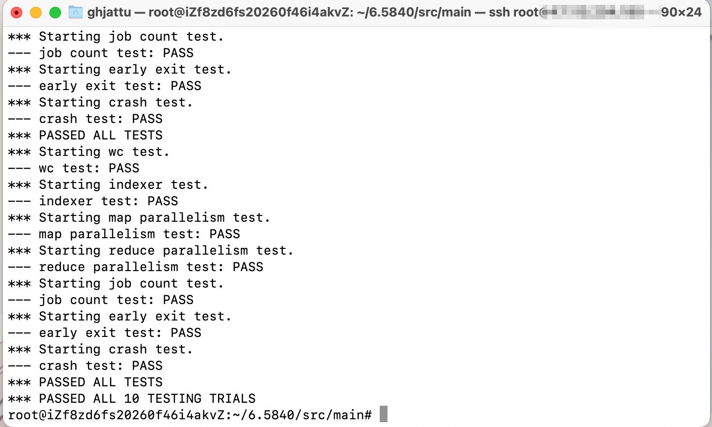

本文首先对课程给出的示例代码进行简要的分析，然后对于要自己实现的部分简单叙述一下思路。

## wc.go

这里定义了后续要用到的 map 函数和 reduce 函数，整体思路和论文中单词计数的伪代码一致，比较简单，没什么好说的。

## mrsequential.go

这是 Lab 给出的 MapReduce 的顺序实现，没有涉及任何的分布式系统和 goroutine 的知识，代码量不超过 100 行，如果对 MapReduce 模型的执行过程有较清楚的认识的话就很容易看懂。

`main` 函数首先通过 `loadPlugin` 函数取得 `wc.go` 中定义的 map 函数和 reduce 函数。

>`loadPlugin` 函数中使用了 plugin 库，这是 Go 语言在 1.8 版本引入的标准库，它允许将 Go 包编译成共享库(.so)的形式单独发布，程序可以在运行时动态加载这些库文件，使用库文件中导出的变量和函数，plugin 库只有两个导出函数，`Open` 用来打开一个 .so 文件，`Lookup` 用来从 .so 文件中寻找导出的变量和函数，具体可以在 Go 的 [plugin 库的官方文档](https://pkg.go.dev/plugin) 里查看。

由于 `Lookup` 函数的返回值是空接口类型，因此在 `loadPlugin` 函数中使用了两次类型断言来获取接口值中保存的动态值。

接着定义了一个slice `intermediate` 来保存所有的中间键值对，遍历所有的输入文件，把输入文件传入 map 函数，再将返回的中间键值对插入 `intermediate` 中。此时 `intermediate` 中保存的元素都具有 <word,"1"> 的形式。

然后对中间键值对按 key 也就是单词升序排序，最后遍历整个 slice ，排序之后某一个单词只出现在 $[i,j]$ 这一个连续区间内，把具有相同 key 的 value 保存在 `values` 列表中，传入 reduce 函数，得到某一个单词的出现次数，然后写入输出文件。

## 需要实现的部分

`mrcoordinator.go` 中调用 `coordinator.go` 文件中的 `MakeCoordinator` 函数，传入输入文件名的列表和 reducer 的个数，然后等待返回的 coordinator 的 `Done` 函数返回 `true` 后结束。

`mrworker.go` 的 `loadPlugin` 函数在前面的内容讲过了，`main` 函数最后将 map 函数和 reduce 函数传入 `worker.go` 中创建多个 worker 。

下面介绍一下我的实现思路，首先回答几个问题：

1. **worker如何获取任务，如何通知coordinator任务已完成？**

   worker 通过 RPC 主动向 coordinator 请求任务，拿到任务后执行相应的处理，关于通知 coordinator 任务已完成，我的思路是在请求任务时的 RPC 参数 args 中增加一个 `bool` 类型的变量 `HaveFinishedTask` 来告知 coordinator 是否有已完成的任务。

2. **coordinator如何确定该分配Map任务还是Reduce任务？**

   我在 `Coordinator` 的结构体中增加了三个 slice：`idleTasks` 、`runningTasks` 和 `finishedTasks` ，还有一个字段 `phase` 表示当前是 Map 阶段还是 Reduce 阶段。最初，`phase` 值为 "Map"，`idleTasks` 中保存的都是 Map 任务。在分发任务之前检查 `idleTasks` 和 `runningTasks` 是否为空，`finishedTasks` 元素个数是否等于 Map 任务数，若满足条件则说明 Map 任务均已完成，那么把 `phase` 改为 "Reduce"，并且把 `idleTasks` 存入 Reduce 任务。判断 Reduce 任务是否全部完成也是相同的思路。

3. **worker如何确定是Map任务还是Reduce任务？**

   创建一个名为 `Task` 的结构体，里面存入一个字段 `TaskType` 表示该任务是 Map 任务还是 Reduce 任务。

4. **如何保存中间文件？**

   为了保证某个 worker 故障时已经写入的部分文件对其他 worker 不可见，Lab 指导中推荐的做法是 worker 先写入一个临时文件，待任务彻底完成时再执行文件重命名。我的具体实现是 worker 使用 `os.CreateTemp` 写入临时文件，然后把临时文件名附带在 RPC 的请求参数中传回给 coordinator，由 coordinator 使用 `os.Rename` 完成临时文件的重命名工作。

5. **如果任务都已分配，又有请求到来怎么办？**

   在 RPC 响应 reply 中增加一个 `bool` 类型字段 `HaveNewTask` 表示此次响应是否分配了新任务，若为 `true` 则 worker 处理；为 `false` 则 worker 等待 200ms 后再次发起请求。

6. **worker中途崩溃了如何处理？**

   Lab1 简化了崩溃的判断，如果一个任务超过 10 秒还没有完成，则 coordinator 认为处理该任务的 worker 已经崩溃，需要重新分配该任务。我在实现的时候参考了论文中 3.3 Fault Tolerance 里的 Worker Failure。如果一个 worker 崩溃了，那么由该 worker 完成的所有 Map 任务都要重新分配，但已完成的 Reduce 任务不用重新分配。

7. **如何为每个任务设置定时器？**

   我的写法是在分配任务的时候在 `Task` 结构体的 `StartTime` 字段中写入当前的时间，然后把任务放入 `runningTasks` 列表中。然后创建一个额外的 goroutine 每隔一秒检查 `runningTasks` ，把超时的任务放入 `idleTasks` 等待重新分配。

   **PS:** 这个设置定时器的方法我觉得不太好，但是暂时想不到更好的了，姑且先这样写了。

8. **coordinator和worker如何退出？**

   coordinator 退出是由 `coordinator.go` 中的 `Done()` 函数完成的，在 `Coordinator` 结构体中增加一个 `bool` 类型的字段 `allTasksDone` 来表示所有任务是否已完成。在 `Done()` 函数中判断所有 Reduce 任务是否都完成了，若是则将 `ret` 和 `allTasksDone` 均设为 `true` 。`mrcoordinator.go` 在收到 `Done()` 返回值为 `true` 之后等待一秒然后终止。

   worker 退出可以在 RPC 响应 reply 中增加一个 `bool` 类型字段 `AllTasksDone` ，其值和 `Coordinator` 结构体中的 `allTasksDone` 字段值保持同步。worker 在成功收到响应后首先检查 `AllTasksDone` 是否为 `true` ，若是则直接 `return` 退出。


弄清楚这些问题之后就可以写代码了，首先是 RPC 请求和响应的参数：

```go
type AskForTaskArgs struct {
	WorkerID         int
	FinishedTask     Task
	HaveFinishedTask bool
	TemporaryFiles   []string
}

type AskForTaskReply struct {
	WorkerID     int
	Task         Task
	HaveNewTask  bool
	AllTasksDone bool
}
```

`WorkerID` 就是发起请求的 worker 的 ID， `HaveFinishedTask` 表示此次请求是否通知上一个任务已完成，若是则 coordinator 从 `TemporaryFiles` 中取出临时文件执行重命名。其他字段在上面都有讲到。

下面是 `Task` 和 `Coordinator` 结构体的定义：

```go
type Task struct {
	TaskID    int
	TaskType  string    // "Map" or "Reduce"
	Filenames []string
	StartTime time.Time
	WorkerID  int
	NReduce   int
}

type Coordinator struct {
	mu            sync.Mutex
	phase         string
    nMap          int
	nReduce       int
	workerCounter int
	idleTasks     []Task
	runningTasks  []Task
	finishedTasks []Task
	failedWorkers map[int]bool
	allTasksDone  bool
}
```

`Task.Filenames` 由 coordinator 写入，保存了此任务需要读取的文件名。

`Coordinator.workerCounter` 是一个计数器，给发起请求的 worker 编号，`Coordinator.failedWorkers` 保存崩溃的 worker 编号。

剩下的具体代码就不贴出来了，能自己完成整个 Lab 会有很大收获🥰。



跑了十次测试，都通过了，说明代码应该可能没有太大的问题（至少这十次来说），后面有问题再改咯。

完结撒花🎉
