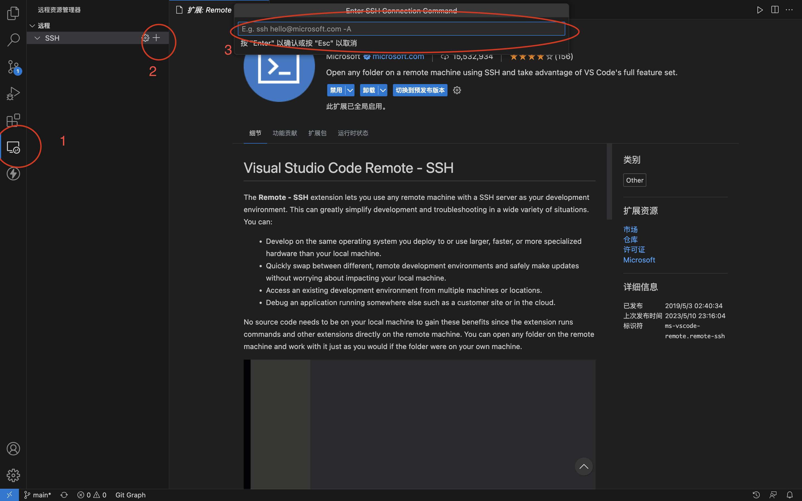

为了更好地学（瞎）习（搞）Linux 命令，今天我去阿里云用学生优惠白嫖了一台 ECS ，这篇文章记录一下从连接 ECS 到安装 Go 最后用 VSCode 编写代码的过程和遇到的问题。

## 远程连接ECS

这一步遇到的问题是：在管理台点击远程连接输入密码后会遇到一个服务器不允许密码登陆的错误，同时错误下方也会给出若干排查方法，主要是开启 root 用户远程登录，参考这篇文章解决：[通过密码或密钥认证登录Linux实例](https://help.aliyun.com/document_detail/147650.html?#section-m1n-unh-gr1) 。

然后使用一个 SSH 客户端输入公网 IP 和密码登陆，如果显示 `Welcome to Alibaba Cloud Elastic Compute Service !` 就说明登陆成功了。

## 安装Golang

这一部分的主要目标就是在 `/usr/local` 目录下解压安装包，下面的过程参考了官方文档，首先通过 `pwd` 和 `ls` 命令来定位寻找正确的路径：

```shell
cd usr/local
# 下载
wget -c https://studygolang.com/dl/golang/go1.20.4.linux-amd64.tar.gz
# 解压
tar -xzf go1.20.4.linux-amd64.tar.gz
```

>我使用的 ECS 登陆后默认在 `/root` 文件夹下，而 `usr` 和 `root` 文件夹是同级的，所以可能需要先 `cd ..` 前往上层目录。

然后执行 `ls` 命令就能看到多了一个 `go` 的文件夹。

接下来就是把 `/usr/local/go/bin` 加到环境变量中：

```shell
cd ~
vim .profile
```

把下面一行加入到 `.profile` 文件中：

```shell
export PATH=$PATH:/usr/local/go/bin
```

保存并退出，重新加载环境变量：

```shell
source .profile
```

现在执行 `go version` 看到版本信息 `go version go1.20.4 linux/amd64` 就说明安装成功了。

执行 `go env` 可以看到相关的环境变量，例如 `GOMODULE` 和 `GOPROXY` 都可以设置成和本地一致。 

## VSCode连接

在插件里搜索 Remote SSH，安装后会在左侧菜单栏里出现一个远程资源管理器的图标，按照下图中的顺序，先点击图标，在点击“添加”，然后在弹出的输入框内按照提示的格式输入用户名和 IP 地址，按“Enter”保存到 config 文件中。



然后在远程资源管理器中刷新一下就能看到添加的服务器的地址，点击服务器然后连接，成功后会在 VSCode 上方要求输入密码，验证通过后就可以像在本地一样写代码了。

想关闭连接的话就点击左下角的 SSH：xxx.xxx.xxx，在弹出的对话框中点击关闭就OK了。
