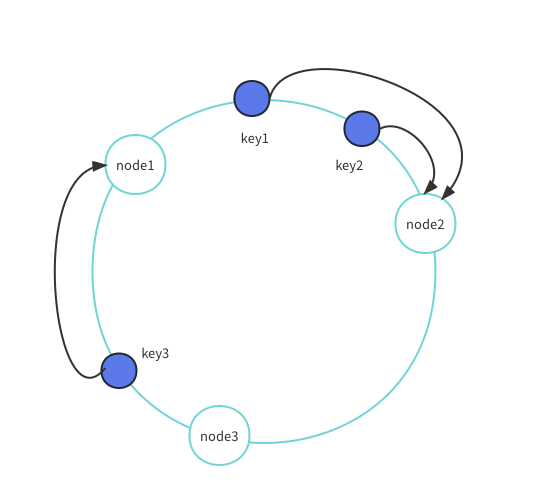

## 什么是哈希

通俗地说，哈希算法就是将一个大的取值空间，通过一个哈希函数的处理，映射到一个小的取值空间上（通常是整数，被称作是哈希值）。例如将不同的英文字符串经过简单的 ASCII 码相加然后取模的处理映射到 `0...99` 的值域内。通过选择尽可能好的哈希函数，可以将大的取值空间尽可能均匀地映射到小空间上，从而获得较好的存取效率。

## 分布式缓存

缓存机制大家都不陌生了，为了减轻数据库的负担同时提升性能，应用通常先从缓存中获取数据，如果未命中，则向数据库发出请求，并把返回的数据保存在缓存中。分布式缓存是分布式系统的一种，它是对传统的单机缓存的扩展。由于单计算机内存容量的限制，我们可以把大的缓存系统拆分部署在多个服务器上，通过增减服务器来适应不同大小的缓存需求。

此时产生了一个问题：对于一个请求中的 key，该到哪个服务器中查询呢？

一个简单的方式是用 hash 值对服务器的个数取模，设服务器的个数为 $N$ ，则选择的服务器编号为 $hash(key)\ mod \ N$ ，取得编号后再查询到服务器的 IP 地址。当服务器不发生宕机或服务器个数不发生改变的时候取模的方法可以工作地很好，但是一旦服务器的数量发生了变化，相应的模数 $N$ 就要发生变化，导致绝大多数 key 对应的服务器节点也发生了变化，节点在收到新的请求后，都需要去数据库重新取回数据，容易引起**缓存雪崩** ：缓存在同一时刻全部失效，导致瞬时数据库请求量大，压力骤增，引发雪崩。

所以我们需要一种不直接依赖服务器数量的映射方法，下面介绍的一致性哈希算法提供了一种思路。

## 一致性哈希

想象存在一个很大且连续的哈希值域如 $0,1,\dots,2^{32}-1$ ，把它首尾相连构成一个环（被称作哈希环），一致性哈希的主要思想是将每个缓存服务器和一个或多个哈希值域区间关联起来，其中区间端点通过计算缓存服务器对应的哈希值确定，如果一个缓存服务器被移除，则它对应的区间会被合并到相邻的区间，其他的缓存服务器不需要做出任何改变。

在具体的实现上，我们首先计算缓存服务器的哈希值（例如使用服务器的名称或 IP 地址）放在环上，对于一个请求的 key，同样计算出哈希值放在环上，顺时针（或逆时针）找到的第一个节点就是应该选取的缓存服务器。

对应上图，按照顺时针序，key1 和 key2 都会被映射到服务器 node2 上，而 key3 会被映射到服务器 node1 上。

当删除一台服务器时，该服务器上保存的缓存值都需要移动到按顺序的下一台服务器上，如删除上图中的服务器 node2，那么 key1 和 key2 都要移动到服务器 node3 上；当添加一台新服务器时，该点的下一台服务器也需要将相应的数据保存到新服务器上。

当缓存服务器过少时，容易引起数据倾斜问题，也就是服务器都集中在环上的一小部分，导致缓存负载不均，并且此时增加一台服务器仍有可能导致大规模的缓存失效。为了解决这个问题，让服务器均匀地分布在环上，我们引入虚拟服务器这一概念，一个真实的服务器对应多个虚拟服务器，例如 node1.1 、node1.2 、node1.3 等等，具体的虚拟服务器数量根据具体情况分析确定。此时我们需要计算出所有虚拟服务器的哈希值（例如使用 IP 地址再加一个编号）然后放在环上，然后计算 key 的哈希值找到对应的虚拟服务器，例如是 node1.2 ，就对应真实服务器 node1 。这种方法代价很小，只需要维护一个虚拟服务器到真实服务器的映射。

在使用一致性哈希算法后，增加或减少服务器一般只会导致 $K/N$ 个 key 需要重新定位，其中 $K$ 是关键字 key 的总数，$N$ 是服务器的数量，也就是说，只需要重新定位附近的一小部分数据，大大减轻了数据库的负担。

