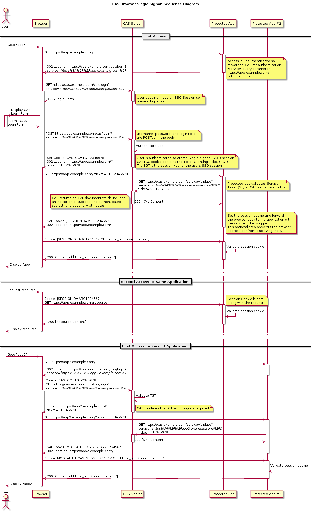
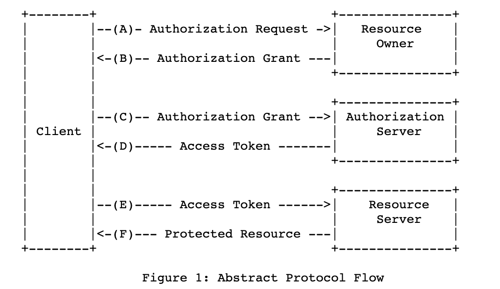
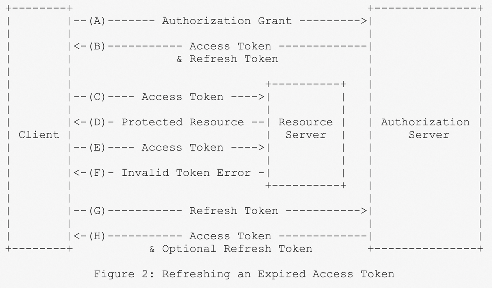

## 背景
众所周知，HTTP 协议是无状态的，服务器不会保存关于客户端的任何信息，对于服务器来说，每个请求都是独立的，服务器无法判断多个请求是否来自同一个用户或会话。
对于用户来说，在每次请求个人数据时都需要输入用户名和密码，这是不能接受的。
所以，我们需要维护一个标记来表示用户已经登录了，前端在发起请求时带上这个标记，服务器就知道是来自谁的请求了。前端获取这个标记很简单，只需要后端在登录成功后返回给前端即可，问题是前端将这个标记保存在哪里呢？

浏览器提供了 localStorage 和 sessionStorage 来允许我们在浏览器上保存键值对，但它们也存在一些问题：
- localStorage ：localStorage 中的数据不会过期，它们在浏览器重启甚至系统重启后仍然存在，只能通过执行相应的 JavaScript 代码来删除它们。这意味着，用户可以一直保持登录状态。
- sessionStorage ：sessionStorage 中的数据只保存在当前的标签页，当标签页关闭时，数据也会被清除。这意味着，用户重新打开标签页后都需要重新登录。

综上，localStorage 和 sessionStorage 的有效时间都太极端了，并不适合用于保存登录状态。此外，若使用 storage 来保存，我们需要在每个发起请求的前端代码中都编写重复的获取 storage 的代码，十分繁琐。

## Cookie
cookie 是直接存储在浏览器中的一段数据，它通常是由服务器在响应的 HTTP header 中使用 `Set-Cookie` 字段设置的。默认情况下，cookie 会在浏览器关闭后自动删除，不过我们可以用 `Expires` 或 `Max-Age` 字段来指定 cookie 何时过期，其中 `Expires` 字段是一个时间戳，格式是 GMT，表示 cookie 在该时间戳失效；`Max-Age` 字段是一个数字，单位为秒，表示 cookie 在多少秒后失效。此外，在对相同域发起请求时，浏览器会自动在 HTTP header 中的 `Cookie` 字段中添加上未过期的 cookie。

所以，cookie 最常见的用处之一就是维护登录状态。此时，后端服务会在用户登录之后创建一个 session，它一般是一条数据库记录，保存了该用户的相关信息，然后后端在响应中使用 `Set-Cookie` 来让浏览器保存 session 的 id，下次向相同域的请求，浏览器会带上这个 id，服务器用 id 去匹配 session 来判断用户登录。

在使用 cookie 时，为了安全，需要设置一些选项：
- `secure` ：这个选项使得 cookie 只能通过 HTTPS 传输。
- `httpOnly` ：这个选项禁止 JavaScript 访问 cookie，防止 XSS 攻击。

## Session
对于前端来说，cookie 和 session id 结合的方案解决了登录标记保存的问题，但是对于后端来说，服务器需要保存所有登录用户的 session，这无疑是巨大的开销。此外，当我们将服务部署为集群时，用户在机器 A 上登录，那么机器 A 保存了用户的 session，但是当用户的请求被转发到机器 B 时，因为没有相应的 session 信息而被判断为未登录，这个问题有两种解决方案：
1. 在一台服务器上创建的 session 需要同步到其他所有服务器。这需要应用实现一个一致性协议来保证所有服务器的 session 一致，增加了复杂性。
2. 采用一个单独的服务器 C 来保存所有的 session，其他服务器需要向 C 请求对应的用户信息。但当应用的并发量很高时，服务器 C 的压力会很大，若服务器 C 宕机了，所有的用户都需要重新登录。如果将 C 部署为集群，又会面临一致性的问题。

## Token
为了解决服务器保存 session 压力过大的问题，再考虑到用户的登录信息比较小，最终选择将用户的信息编码到一个 token 里，让浏览器在 cookie 中携带这个 token，这样后端拿到 token 就可以验证用户的状态了，而不需要再去数据库中查询。
常见的 token 格式规范是 JWT(JSON Web Token)，简单来说，JWT 允许应用在 token 中添加自定义的信息，比如保存用户的 id 等信息，然后它会对这些信息进行加密，不过考虑到加密也存在被破解的可能，所以不建议在 token 中保存用户的敏感信息。
并且 JWT 可以为设置一个过期时间，后端校验 token 失败后返回一个错误响应，前端可以直接重定向到登录页面。

(借用一下参考文章中的时序图)

### Refresh Token
当我们使用 JWT 时，为了更高的安全性，尤其是一些权限敏感的资源，我们通常会为 token 设置一个较短的过期时间，这样即使 token 被盗用，也只会造成较短的危害，但是较短的过期时间会导致用户频繁地执行登录操作，对用户不友好；此外，当用户的权限发发生变化时，对应的 token 也需要变化，但是因为权限变更导致用户再次登录也是不好的设计。因此，我们引入了 Refresh Token 的概念，而原先的 token 被称为 Access Token。

Refresh Token 也是一个 JWT，它有着比 Access Token 更久的过期时间，作用在于：当 Access Token 过期用户权限变更时，前端会收到一个错误响应，然后前端会用 Refresh Token 去获取一个新的 Access Token，如果 Refresh Token 过期，则用户需要重新登录。

(再借用一下参考文章中的时序图)

上述的 cookie 与 token 结合的方案已经可以满足很多的应用需求了，不过该方式还是有一些缺陷：
1. 无法实现主动踢人功能。如果要实现这个功能，可以考虑增加一个黑名单缓存来保存被踢用户的 id，当用户发起请求时，检查 token 中的 id 是否在黑名单缓存中，若在，则返回错误响应，前端重定向至登录界面。
2. 只有同域的请求才会携带 cookie，如果我们的应用的域名分别是 `a.example.com` 和 `b.example.com`，那么可以通过设置 `domain` 字段为 `example.com` 来让子域名共享 cookie。但若域名分别是 `site-one.com` 和 `site-two.net`，就没有办法共享了。

## JWT vs Session
JWT 和 Session 都是用于认证的方案，它们的区别在于：
- 从类型上讲，JWT 属于计算型方案，服务器需要对 JWT 进行解析才能得到其中的信息；Session 属于存储型方案，服务器需要频繁查询数据库，大量的 session 会对服务器造成压力。
- 从安全性上讲，JWT 签发之后在过期前一直有效，自身无法实现踢人下线的功能，一旦泄露，任何人都可以用 token 登录；Session 保存在服务器中，不易泄露，并且可以轻松地删除某个用户的登录状态，但是服务器宕机后，所有用户的登录状态都会丢失。

到底选择 JWT 还是 Session 取决于具体的场景需求。

## 单点登录 SSO
Single Sign On，也即 SSO，是将多个应用的登录状态集中管理，用户只需要登录一次，就可以在多个应用中保持登录状态，它解决了跨域登录的问题。

在上图中，SSO 中心是一个独立的认证服务用于管理 token，三个应用都接入了这个服务，当用户在任何一个应用登录之后，其余的所有应用都免登录了。

SSO 方案的便利性是显而易见的：
- 从用户的角度看，只需要记住一个账号密码就可以访问多个应用，若每个应用都对应一个不同的密码，在记忆和修改密码方面都十分不便。
- 从应用管理员的角度看，一个用户对应一个账户，意味着只需要一个管理面板即可对用户在多个应用的权限做出迅速地约束。

并且，因为多个应用共享一套密码，所以 SSO 系统会对密码的强度做出更高的要求，使得密码破解更困难。

常见的 SSO 协议有 CAS 和 OAuth2，它们都适用于 B/S 架构，本质上大同小异，都是基于中心信任的机制，只是每个协议信息交换的细节不同。下文对这两个协议做简单的介绍。

### CAS
CAS，全称 Central Authentication Service，一个 CAS 架构至少包括三个部分：
1. 浏览器客户端
2. 用户需要访问的应用程序
3. CAS 服务器，用于校验用户凭证

在 CAS 协议中，用户的认证过程只会发生在 CAS 服务器中，也即应用程序是接触不到用户凭证的。

CAS 协议的登录流程可以简单概括为：
1. 用户在浏览器中以未登录状态访问应用程序，应用程序会让浏览器重定向至 CAS 服务器。
2. CAS 服务器此时没有用户的 session，所以会返回一个登录页面。
3. 用户在登录页面输入凭证。
4. CAS 服务器校验凭证，若成功，会在本地创建一个全局的 session 保存登录状态，然后让浏览器重定向回应用程序，并在应用程序的 URL 后追加一个 service ticket。
5. 应用程序向 CAS 服务器发起请求，验证 service ticket 的有效性。
6. CAS 服务器校验 service ticket，若有效，向应用程序返回用户信息。
7. 应用程序显示登录成功，并创建一个局部 session 保存登录状态。

当用户以登录状态访问另一个应用程序 B 时，应用 B 没有局部 session，所以会重定向至 CAS 服务器，服务器发现有用户的全局 session，直接重定向回应用程序 B，并附加一个 service ticket，后续的流程与上文相同。

完整的 CAS 认证流程还涉及到一些关键概念：
1. Service Ticket(ST): ST 是一次性的，代表用户访问特定 service 的访问凭证。
2. Ticket-Granting Ticket(TGT): 在验证用户凭证成功后，CAS 服务器会生成一个全局的 TGT，代表用户已经通过认证，它会关联一些用户的信息。
3. Ticket-Granting Cookie(TGC): TGC 是与 TGT 相关的，TGC 是用于标识一个全局 session 的 Cookie，会保存在用户的浏览器中。

借一下 Apereo 社区里的时序图，可以说是十分详细了：

[https://apereo.github.io/cas/development/images/cas_flow_diagram.png](https://apereo.github.io/cas/development/images/cas_flow_diagram.png)

CAS 的登出过程相对简单一些：

### OAuth2
OAuth 是一个开放的授权协议，它包括四种模式，这里介绍最常用的授权码模式。

OAuth 协议中包括四种角色：
1. Resource Owner 资源所有者：能够授予对被保护资源的访问权的实体。
2. Resource Server 资源服务器：存储被保护资源的服务器，能够接收令牌然后将相应的资源返回给令牌所有者。
3. Client 客户端：期望得到资源所有者授权并访问被保护资源的实体。
4. Authorization Server 授权服务器：能够验证资源所有者身份，并根据资源所有者的授权向客户端颁发令牌。授权服务器可以是独立的服务器，也可以和资源服务器是同一台服务器。

下图是 OAuth2 的协议流，大致分为三个步骤：

结合一个具体的例子来对这三个步骤进行更详细地描述：假设我们开发了一个 Web 应用程序，实现了使用 GitHub 账号登录的功能，那么这个 Web 应用就是 Client；打算使用 GitHub 进行登录的用户就是 Resource Owner；GitHub 是 Resource Server 和 Authorization Server 的提供者。

> 在实现 GitHub 账号登录的功能之前，我们需要在 GitHub 上注册开发的 Web 应用，得到应用的 client id 和 client secret。参考文档：[Creating an OAuth app](https://docs.github.com/en/apps/oauth-apps/building-oauth-apps/creating-an-oauth-app) 。

1. Client 获取授权许可(Authorization Grant)  
(A) Client 向 Resource Owner 请求授权。这一步的具体实现中，Client 会将 Resource Owner 重定向到 Authorization Server 的一个特定页面上，Resource Owner 可以在此页面上进行授权。  
例如：当用户点击了 Web APP 上的 “GitHub 登录” 按钮后，Web APP 会使浏览器重定向至 GitHub 的授权页面 `https://github.com/login/oauth/authorize`，并附带 `client_id`, `redirect_uri` 和 `state` 等参数。  
(B) Client 获取到 Authorization Grant。  
例如：用户在授权页面上登录 GitHub 账号并给予授权，接着浏览器会重定向至 `redirect_uri` 指定的地址，它仍是我们的 Web APP 中的地址，并附带一个 `code` 参数，用于后续获取 Access Token。GitHub 提供的 `code` 参数存在 10 分钟的有效期，并且只能使用一次。
2. Client 获取访问令牌(Access Token)  
(C) Client 向 Authorization Server 提供 Authorization Grant，请求 Access Token。  
例如：Web APP 向 GitHub 发送请求，地址为 `https://github.com/login/oauth/access_token`，并携带 `client_id`, `client_secret` 和 `code` 参数。  
(D) Authorization Server 验证 Client 的身份，并验证 Authorization Grant 的有效性，若成功，则返回 Access Token。  
例如：GitHub 对携带的参数进行校验，校验通过后会返回 access token。
3. Client 访问受保护的资源  
(E)Client 向 Resource Server 请求受保护的资源。  
例如：Web APP 向 GitHub API 请求用户的信息，地址为 `https://api.github.com/user`，并在合适的位置携带 access token。  
(F) Resource Server 校验 Access Token，若成功，则返回资源。

在 OAuth2 中，Access Token 是用来访问被保护资源的凭证，只要能被 Resource Server 理解即可，所以它可以是一串无意义的随机字符串，当然也可以是 JWT，用于编码一部分用户的信息。

同时，OAuth2 也支持 Refresh Token 的机制，Refresh Token 只会与 Authorization Server 交互，不会被发送给 Resource Server。GitHub 上关于 Refresh Token 的用法在：[Refreshing user access tokens](https://docs.github.com/en/apps/creating-github-apps/authenticating-with-a-github-app/refreshing-user-access-tokens) 。

### CAS vs OAuth2
CAS 是认证协议，用于用户登录；而 OAuth2 是授权协议，但也可以完成用户登录，可以理解为 OAuth2 协议覆盖了 CAS 的功能。在 CAS 协议中，ticket 过期了之后只能重新登录，而 OAuth2 提供了 Refresh Token，可以在后台更新 Access Token。

在安全性上，OAuth2 需要开发者提前注册应用获取 `client_id` 和 `client_secret` 用于后续的校验，并且在获取 Access Token 的流程中提供了 `state` 参数用于防止 CSRF 攻击，和 `scope` 参数用于指定获取资源的范围。

综上，目前还是尽可能地使用 OAuth2 协议，因为它更加安全，并且可以提供更多的功能。

**END**

## 参考资料
1. [浅析前端登录鉴权流程 - 掘金](https://juejin.cn/post/7137186649741459463?from=bytetech)
2. [Storing data in the browser - The Modern JavaScript Tutorial](https://javascript.info/data-storage)
3. [Central Authentication Service - Wikipedia](https://en.wikipedia.org/wiki/Central_Authentication_Service)
