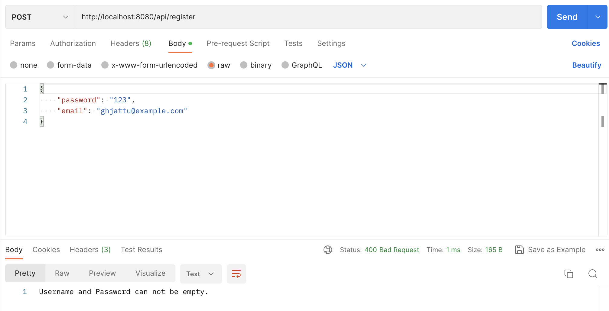
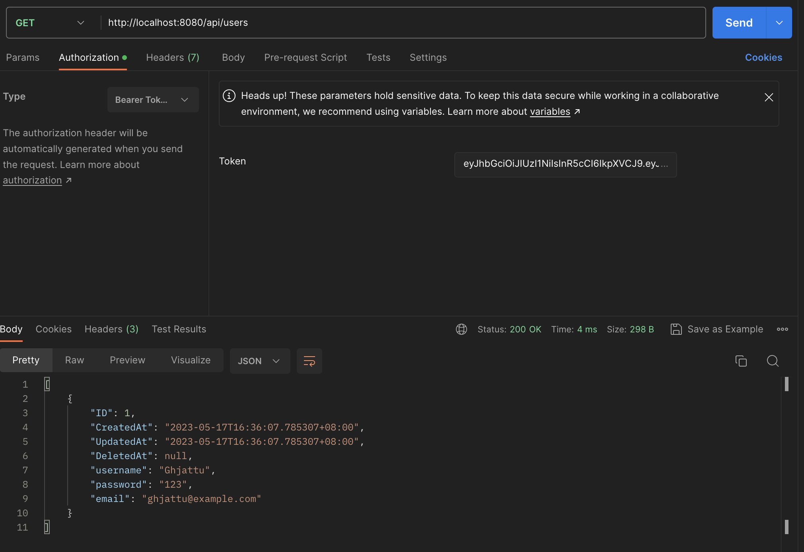

## 什么是JWT

JWT（JSON Web Token）是一个开放标准（RFC 7519），用于作为 JSON 对象在各方之间安全地传输信息。JWT 被广泛应用于用户身份验证，此外，生成的 token 还可以被公钥/私钥对进一步加密，因此也可以用来进行一些信息交换。

## JWT的结构

JWT 包括由（`.`）连接的三部分：Header、Payload 和 Signature，看起来就像这样：`xxx.yyy.zzz` 。

### Header

Header 通常由两部分组成：一个是 token 的类型，这里是 jwt；另一个是用于 Signature 的算法，可以是HMAC SHA256 或 RSA。

例如，Header 可以是下面的 JSON 对象：

```json
{
  "typ": "JWT",
  "alg": "HS256"
}
```

然后对这个 JSON 对象进行 Base64 编码得到第一部分 `xxx` 。

### Payload

Payload 中包含了若干声明（claims），用来表示用户的某些信息和一些额外的信息，声明分为三类：Registered Claims、Public Claims 和 Private Claims 。

#### Registered Claims

这些是为了应用程序使用而保存的标准声明，例如：

- **iat**：jwt 的签发时间
- **exp**：jwt 的过期时间
- **iss**：签发者

等等，完整的列表可以参阅 [RFC 7519](https://datatracker.ietf.org/doc/html/rfc7519#section-4.1) 。这些声明建议但不强制使用。

#### Public Claims

这部分可以声明与用户相关的信息，如 email 等。**不建议声明敏感信息**。

#### Private Claims

这部分声明通信双方共同定义的信息，**不建议声明敏感信息**。

下面是一个 Payload 的例子：

```json
{
  "iat": "20233801382",
  "exp": "20244302402",
  "email": "alice@example.com"
}
```

然后对这个 JSON 对象进行 Base64 编码得到第二部分 `yyy` 。

### Signature

Signature是由 `xxx.yyy` 这个字符串和一个 secret-key 执行 Header 中声明的签名算法得到的，例如：

```
HMACSHA256(
	base64UrlEncode(header) + "." +
  base64UrlEncode(payload),
  secret-key)
```

secret-key 是服务器生成的并且保存在服务器，可以用来验证 token 是否被篡改，JWT 签发也是服务器完成的，secret-key 在任何时候都不应该泄漏出去。

关于 JWT 的更多信息，可以参阅 [jwt.io](https://jwt.io/introduction/) 。

下面我们用 Fiber 框架实现一个简单的带有 JWT 授权的 REST API 。

## API 定义

应用一共包含三个端点：

两个公开的端点：

```
/api/login
/api/register
```

其中 `/api/login` 认证用户身份通过后会返回一个 token 。

一个私有的端点：

```
/api/users
```

私有端点只有在 token 验证成功后才能访问，返回所有已注册用户的信息。

## 数据库模型

应用使用 SQLite 保存注册用户的信息，并用 [GORM](https://gorm.io) 库简化数据库操作。

在 `models/user.go` 文件中，定义 `User` 模型：

```go
type User struct {
	gorm.Model
	Username string `json:"username" gorm:"not null; unique"`
	Password string `json:"password" gorm:"not null"`
	Email    string `json:"email"`
}
```

Go 语言中有一种特殊的函数 `init()` ，它先于 `main()` 函数执行，可以实现一些包级别的初始化操作。因此我们在 `init()` 函数中完成数据库的连接和建表操作：

```go
var db *gorm.DB

func init() {
	d, err := gorm.Open(sqlite.Open("user.db"), &gorm.Config{})
	if err != nil {
		panic("failed to connect database.")
	}
	db = d
	db.AutoMigrate(&User{})
}
```

接下来，完成数据库的插入和查找操作：

```go
func CreateUser(user *User) error {
	err := db.Create(user).Error
	return err
}

func GetAllUsers() ([]User, error) {
	var users []User
	err := db.Find(&users).Error
	return users, err
}
```

##  register端点

register 端点尝试将用户的输入的注册信息保存到数据库中。

在 `controllers/controller.go` 文件中，我们首先来实现 `/api/register` 端点的路由处理函数（为了简单这里没有实现密码 hash）。

```go
func Register(c *fiber.Ctx) error {
	var user models.User
	if err := c.BodyParser(&user); err != nil {
		return c.Status(fiber.StatusInternalServerError).SendString("Internal Server Error.")
	}

	if user.Username == "" || user.Password == "" {
		return c.Status(fiber.StatusBadRequest).SendString("Username and Password can not be empty.")
	}

	if _, err := models.CreateUser(&user); err != nil {
		return c.Status(fiber.StatusInternalServerError).SendString("Internal Server Error.")
	}
	return c.JSON("Registered Successfully.")
}
```

回到项目根目录的 `main.go` 文件，创建一个 Fiber 实例并注册 register 路由：

```go
package main

import (
	"jwt-authorization/controllers"

	"github.com/gofiber/fiber/v2"
	"github.com/gofiber/fiber/v2/middleware/logger"
)

func main() {
	app := fiber.New()
	app.Use(logger.New())

	app.Post("/api/register", controllers.Register)

	app.Listen(":8080")
}
```

接着在根目录执行 `go run main.go` 就可以看到服务器启动了。

现在用 Postman 测试一下 register 端点，


看来用户信息被正确地保存到了数据库，后面就可以用来为登陆作验证了。

下面测试一下 username 为空的情况：



服务器返回了合适的响应！

## login端点

login 端点要做的事很简单：接收 username 和 password 并检查是否和数据库中的某条信息匹配，若匹配则返回一个 token，否则返回一个404 响应。

在编写 login 的处理函数之前，我们先在项目根目录下新建一个 `.env` 文件用来保存 serect-key ，然后打开 `utils/token.go` 文件完成生成 token 的函数：

```go
package utils

import (
	"os"
	"time"

	"github.com/golang-jwt/jwt/v5"
	_ "github.com/joho/godotenv/autoload"
)

func GenerateToken(userID uint) (string, error) {
	claims := jwt.MapClaims{
		"user_id": userID,
		"iat":     time.Now().Unix(),
		"exp":     time.Now().Add(time.Hour).Unix(),
	}
	token := jwt.NewWithClaims(jwt.SigningMethodHS256, claims)

	key := os.Getenv("SECRET-KEY")
	if key == "" {
		key = "secret-key"
	}

	return token.SignedString([]byte(key))
}
```

接下来在 `models/user.go` 中增加函数检查给定的 username 和 password 是否和数据库中的某条数据匹配：

```go
func LoginCheck(username, password string) (uint, uint) {
	var user User

	if err := db.Where("username=?", username).First(&user).Error; err != nil {
		if errors.Is(err, gorm.ErrRecordNotFound) {
			return 0, fiber.StatusNotFound
		}
		return 0, fiber.StatusInternalServerError
	}

	if user.Password != password {
		return 0, fiber.StatusNotFound
	}

	return user.ID, fiber.StatusOK
}
```

然后 `controllers/controller.go` 完成 login 的路由处理函数：

```go
func Login(c *fiber.Ctx) error {
	var user models.User
	if err := c.BodyParser(&user); err != nil {
		return c.Status(fiber.StatusInternalServerError).JSON(fiber.Map{"error": "Internal Server Error."})
	}

	userID, statusCode := models.LoginCheck(user.Username, user.Password)
	if statusCode == fiber.StatusNotFound {
		return c.Status(fiber.StatusNotFound).JSON(fiber.Map{"error": "Username or password is incorrect."})
	}

	token, err := utils.GenerateToken(userID)
	if err != nil || statusCode == fiber.StatusInternalServerError {
		return c.Status(fiber.StatusInternalServerError).JSON(fiber.Map{"error": "Internal Server Error."})
	}
	return c.JSON(fiber.Map{"token": token})
}
```

最后，在 `main.go` 中添加：

```go
app.Post("/api/login", controllers.Login)
```

用 Postman 测试一下 login 端点


成功返回了 token ！可以用这个 [Debugger](https://jwt.io/#debugger-io) 验证一下生成的 token，记得把网页中的 secret-key 替换成自己的。

## JWT验证中间件

中间件通常是一小段代码，它接收一个请求，然后对其进行处理，一个中间件只完成一个任务，完成后传递给下一个中间件或最终处理程序。这样做的好处是降低了程序的耦合度，并且能复用代码。Fiber 里的中间件的签名和 `Handler` 类型是一样的，这样可以和其他的路由处理函数更好地形成一个链。

首先在 `utils/token.go` 文件中验证 token ：

```go
func ValidateToken(c *fiber.Ctx) error {
	tokenString := ExtractToken(c)
	_, err := jwt.Parse(tokenString, func(t *jwt.Token) (interface{}, error) {
		if _, ok := t.Method.(*jwt.SigningMethodHMAC); !ok {
			return nil, fmt.Errorf("unexpected signing method: %v", t.Header["alg"])
		}
		key := os.Getenv("SECRET_KEY")
		if key == "" {
			key = "secret-key"
		}
		return []byte(key), nil
	})

	if err != nil {
		return err
	}
	return nil
}

func ExtractToken(c *fiber.Ctx) string {
	// from query string parameter
	token := c.Query("token")
	if token != "" {
		return token
	}

	// from Header Authorization field
	bearerToken := c.GetReqHeaders()["Authorization"]
	if len(strings.Split(bearerToken, " ")) == 2 {
		return strings.Split(bearerToken, " ")[1]
	}
	return ""
}
```

打开 `middlewares/jwt.go` 文件，创建一个用于验证 token 的中间件：

```go
func JWTAuthorization() func(*fiber.Ctx) error {
	return func(c *fiber.Ctx) error {
		err := utils.ValidateToken(c)
		if err != nil {
			return c.Status(fiber.StatusUnauthorized).JSON(fiber.Map{"error": err.Error()})
		}
		return c.Next()
	}
}
```

在 `main.go` 中使用中间件

```go
app.Use("/api/users", middlewares.JWTAuthorization())
app.Get("/api/users", controllers.GetAllUsers)
```

完成 `/api/users` 的路由函数

```go
func GetAllUsers(c *fiber.Ctx) error {
	users, err := models.GetAllUsers()
	if err != nil {
		return c.Status(fiber.StatusInternalServerError).JSON(fiber.Map{"error": "Internal Server Error."})
	}
	return c.JSON(users)
}
```

最后，用 Postman 测试一下



Perfect ! 如果改变 token 的几个字母，程序也会正确返回 401 响应。

完结撒花 🎉 ！完整的代码在[我的仓库](https://github.com/Ghjattu/golang-basic-projects/tree/main/jwt-authorization)。😃

## 参考资料

1. [https://jwt.io/introduction](https://jwt.io/introduction) 
2. [Creating a New JWT](https://golang-jwt.github.io/jwt/usage/create/)  
3. [https://pkg.go.dev/github.com/joho/godotenv#section-readme](https://pkg.go.dev/github.com/joho/godotenv#section-readme) 
4. [Go Fiber 框架系列教程 03：中间件](https://polarisxu.studygolang.com/posts/go/fiber/go-fiber-basic-tutorial03/) 
5. [https://docs.gofiber.io/api/app#route-handlers](https://docs.gofiber.io/api/app#route-handlers) 
6. [Simple example of parsing and validating a token](https://pkg.go.dev/github.com/golang-jwt/jwt/v5#example-Parse-Hmac) 
